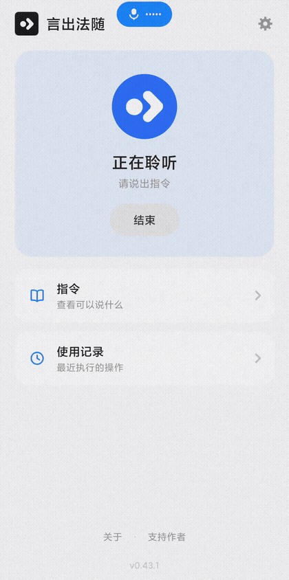
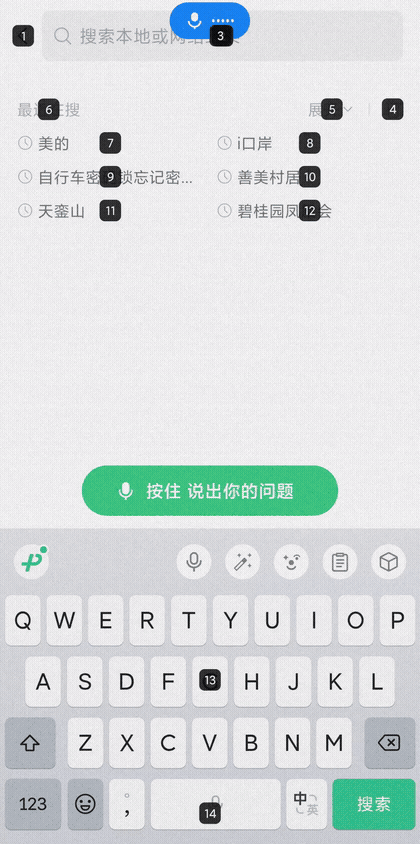
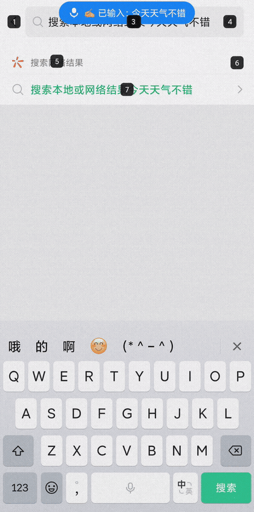
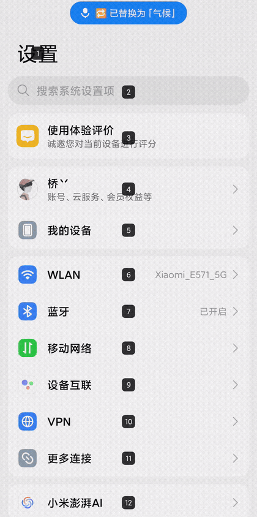
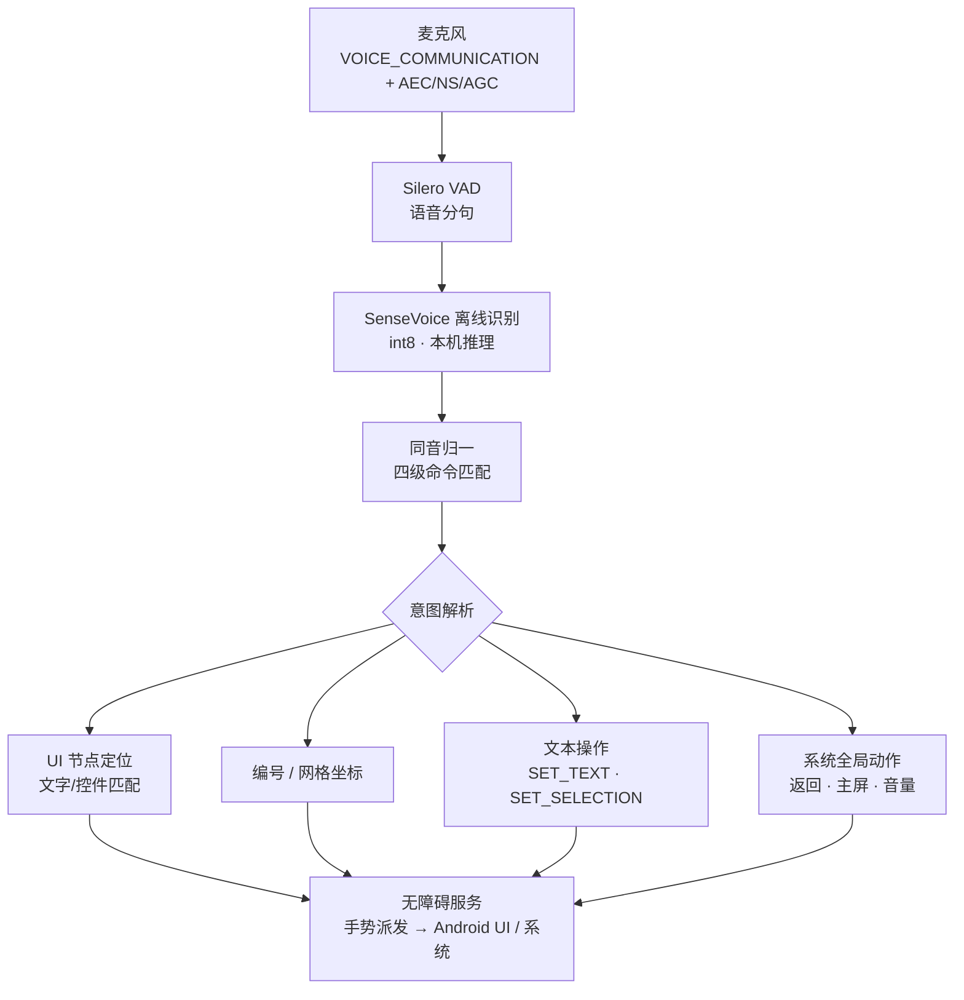

<div align="center">

# 言出法随 · YanChuFaSui

**让 Android 手机听懂你的话。**

[](LICENSE)
[](../../releases)
[](#安装方法)
[](#隐私)

**语言 / Language**：简体中文 ｜ [English](README_en.md)

</div>

---

> 「言出法随」——说出口的指令，随即被执行。

## 看看它怎么工作

**屏幕编号：说「显示编号」，再说「点击 18」**

<p align="center">
  
</p>

**语音听写：说「输入」，说话，文字自动进入输入框**

<p align="center">
  
</p>

**语音替换：说「把天气替换成气候」，输入框里的字被纠正**

<p align="center">
  
</p>

**语音滑动：不碰屏幕，内容照样滚动**

<p align="center">
  
</p>

## 为什么做这个

触摸屏对大多数人来说非常方便。但对另一些用户来说——精确点击一个目标、完成一次长距离滑动、在输入框里打字——这些操作本身就是障碍。

言出法随从一个很朴素的问题开始：**如果一台安卓手机可以几乎完全用语音控制，会怎么样？**

它不重新设计安卓的界面，也不要求用户学习一套新的系统。它借助 Android 无障碍框架，把语音指令转换成当前屏幕上的真实交互——你看着熟悉的界面，用熟悉的说法，完成熟悉的操作。

这个项目由真实的无障碍使用需求推动：它的第一位用户是一位 SMA 患者开发者本人。

## 核心能力

### 屏幕控制
点击、双击、长按、四方向滑动——通过无障碍服务直接驱动当前界面，无需重复学习新手势。

### 网格定位
当应用没有提供清晰的控件时，说「显示网格」把全屏划成十二宫格并逐级细化，说编号即可触达屏幕任意位置。

### 语音输入与编辑
说「输入」后说话，文字自动写入输入框；支持逐字删除、移动光标、以及「把 A 替换成 B」的语音纠错。

### 系统控制
返回、主屏幕、最近任务、音量调节（80% 安全上限）、锁屏、通知中心、控制中心。

### 自定义指令与个人词典
用自己的说法绑定任意动作（语音录入，零打字）；人名、地名加入词典后优先识别。

### 全离线处理
识别引擎与全部语音处理均在设备本地完成，无网络也能完整使用。

## 工作原理



每一次动作都带闭环校验：执行后确认界面是否真的发生变化，未生效时自动回退到手势兜底——命令不会「假成功」。

## Accessibility

本项目使用 Android 无障碍服务（AccessibilityService）读取界面结构并代为执行交互。它存在的目的，是让**精确触摸不再是使用手机的前提**：

- 不要求用户重新学习一个新的手机界面——直接操作 Android 当前的 UI；
- 常见操作（点击、滑动、输入、系统控制）全部可以用语音完成；
- 屏幕编号与网格为「说不清位置」的场景提供确定性坐标。

无障碍权限仅用于上述交互，相关数据不在设备外存储。

## Installation

### 普通用户

1. 从 [Releases](../../releases) 下载最新 APK
2. 安装（允许安装未知来源应用）
3. 按应用内引导完成：电池优化豁免 → 自启动授权 → 开启无障碍服务
4. 建议在最近任务中锁定本应用，保持后台长期运行

系统要求：Android 7.0 及以上。

### Build from source

```bash
# 1. Clone
git clone https://github.com/qb200310-hash/YanChuFaSui.git

# 2. Download recognition models (~240MB, kept out of the repo)
powershell -ExecutionPolicy Bypass -File scripts/download_models.ps1

# 3. Build
gradlew assembleDebug
```

## Examples

| 指令 | 示例 | 动作 |
|---|---|---|
| 点击 | 「点击微信」 | 点击匹配的界面元素 |
| 编号 | 「显示编号」→「点击 18」 | 数字定位到对应元素 |
| 长按 | 「长按」→「3」 | 长按对应位置 |
| 滑动 | 「向上滑动」 | 内容向上滚动 |
| 摇移 | 「向上摇移」 | 小步微调 |
| 缩放 | 「双指放大」 | 捏合放大当前区域 |
| 听写 | 「输入」→「今天天气不错」 | 文字写入输入框 |
| 替换 | 「把不错替换成很好」 | 输入框内语音纠错 |
| 系统 | 「返回」「回桌面」「增加音量」「锁屏」 | 系统操作 |
| 结束 | 「退出」 | 结束会话，归还麦克风 |

## Privacy

言出法随围绕本地处理设计。

对于语音控制而言，语音识别与指令解析**全部在设备本地完成**——应用**未申请 INTERNET 网络权限**，从系统层面就不具备向任何服务器发送数据的能力。无需账号，无云端依赖。

（说明：不含网络权限也意味着不提供在线识别；识别引擎随应用离线内置。）

## Roadmap

**Current（已实现）**：编号与网格定位、四方向滑动与摇移、双指缩放、两步式长按、语音听写与文字编辑、语音替换、自定义指令、个人词典、灵敏度调节、设备控制、崩溃诊断与问题反馈导出。

**Next（规划中，尚未实现）**：

- [ ] 截屏指令
- [ ] 列表回到顶部 / 底部
- [ ] 光标移到开头 / 结尾
- [ ] 滑块控制（音量/亮度/智能家居）
- [ ] 拖拽（按住移动松手）
- [ ] 选择文本

完整版本历史：[CHANGELOG.md](CHANGELOG.md) ｜ 里程碑速览：[MILESTONES.md](MILESTONES.md)

## Contributing

欢迎 Issue 与 PR。提交前请先阅读 [MILESTONES.md](MILESTONES.md)（版本里程碑）与 [CHANGELOG.md](CHANGELOG.md)（更新日志）——「能说的 = 能做的」是本项目对指令表的铁律。

## License

[Apache-2.0](LICENSE) © 2026 黄信豪 (Hugo)

## Acknowledgements

- [sherpa-onnx](https://github.com/k2-fsa/sherpa-onnx) & [SenseVoice](https://github.com/FunAudioLLM/SenseVoice) —— 离线中文语音识别引擎
- [pinyin4j](https://github.com/belerweb/pinyin4j) —— 拼音转换
