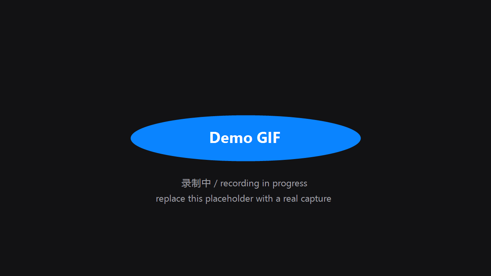
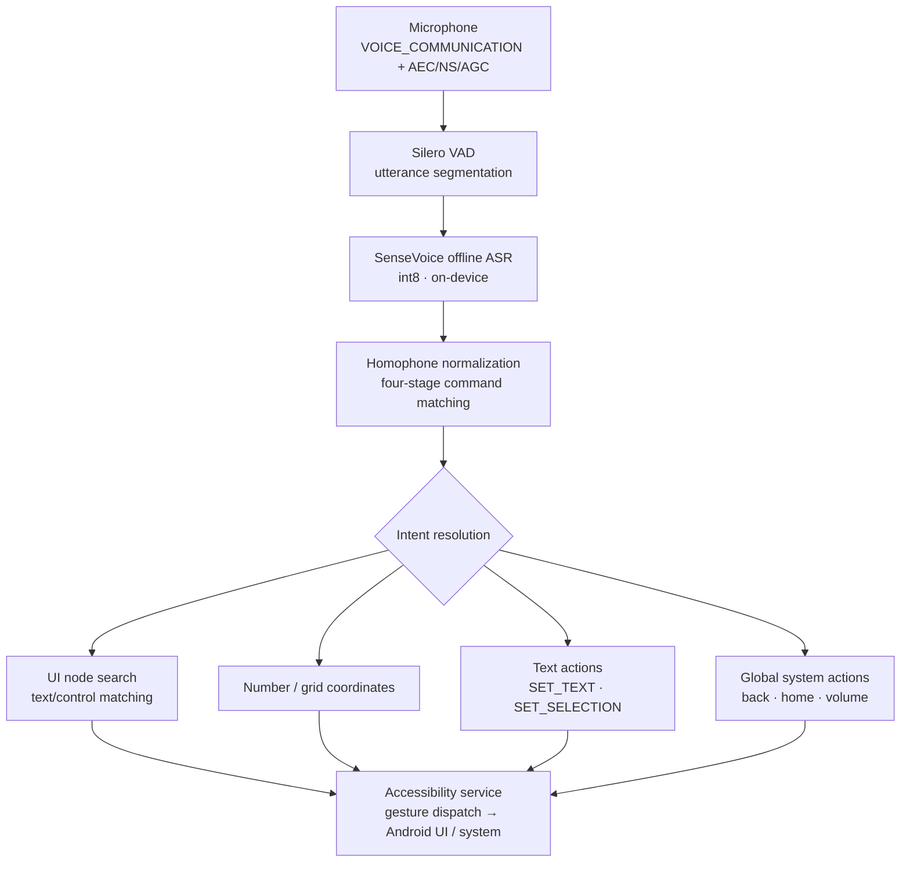

<div align="center">

# YanChuFaSui · 言出法随

**Let an Android phone understand what you say.**

System-level voice control for Android, built for Chinese users and accessibility.

[](LICENSE)
[](../../releases)
[](#installation)
[](#privacy)

**Language / Language**: [简体中文](README.md) ｜ English

</div>

---

> Spoken commands, executed immediately.

> This page mirrors [README.md](README.md) (English is a full translation of the Chinese doc).

## Demo

> **(Demo GIF in progress — this slot will be replaced with a real recording)**

<p align="center">
  
</p>

## Why

Touchscreens are convenient for most people. For others — tapping a small target precisely, swiping a long distance, typing into an input field — these interactions are the barrier.

YanChuFaSui started from a plain question: **what if an Android phone could be controlled almost entirely by voice?**

It does not redesign Android's interface, and it does not ask users to learn a new system. Built on the Android Accessibility framework, it turns spoken commands into real interactions on the current screen — the same UI, the same wording, the same actions.

The project is driven by a genuine accessibility need: its first user is the developer himself, who lives with SMA.

## Core capabilities

### Screen control
Tap, double-tap, long-press, and four-direction swipes — driven through the Accessibility service on whatever screen is currently shown.

### Grid targeting
When an app doesn't expose clear controls, overlay a numbered 12-cell grid (drillable up to 5 levels) and reach any point on screen by number.

### Voice typing & editing
Say a trigger word, speak, and the text lands in the focused input box. Delete character by character, move the cursor, or correct by voice: "replace A with B".

### System control
Back, home, recents, volume (with an 80% safety cap), lock screen, notification shade, quick settings.

### Custom commands & personal dictionary
Bind your own phrase to any action — enrolled by voice, no typing. Add names and places to a personal dictionary so they are recognized preferentially.

### Fully offline
Recognition and all speech processing run on-device. The app works with no network connection at all.

## How it works



Every action is verified in a closed loop: the service checks whether the UI actually changed, and falls back to gesture dispatch when it didn't — commands never "silently succeed".

## Accessibility

This project uses the Android Accessibility service to read the interface and perform interactions on the user's behalf. Its purpose is to make **precise touch optional rather than a prerequisite**:

- No need to learn a new launcher or interface — it operates the Android UI you already have;
- Common operations (tap, swipe, typing, system controls) are all available by voice;
- The number/grid overlays provide deterministic coordinates when words aren't enough.

The Accessibility permission is used only for this interaction; the data it reads is not stored off-device.

## Installation

### Users

1. Download the latest APK from [Releases](../../releases)
2. Install (allow installing from unknown sources)
3. Follow the in-app guide: battery optimization exemption → autostart permission → enable the Accessibility service
4. Recommended: lock the app in Recents so system cleanup never kills it

Requires Android 7.0+.

### Build from source

```bash
# 1. Clone
git clone https://github.com/qb200310-hash/YanChuFaSui.git

# 2. Download the recognition models (~240MB, kept out of the repo)
powershell -ExecutionPolicy Bypass -File scripts/download_models.ps1

# 3. Build
gradlew assembleDebug
```

## Examples

| You say | Example | Action |
|---|---|---|
| Tap | 「点击微信」 | Taps the matching UI element |
| Numbers | 「显示编号」→「点击 18」 | Numbered targeting |
| Long press | 「长按」→「3」 | Long-presses the target |
| Swipe | 「向上滑动」 | Scrolls the content up |
| Nudge | 「向上摇移」 | Small precise adjustment |
| Zoom | 「双指放大」 | Two-finger pinch out |
| Dictation | 「输入」→「今天天气不错」 | Types text into the focused field |
| Replace | 「把不错替换成很好」 | Corrects text by voice |
| System | 「返回」「回桌面」「增加音量」「锁屏」 | System actions |
| End | 「退出」 | Ends the session, releases the microphone |

> Note: the app understands **Mandarin Chinese commands** — the recognition engine is Chinese-native, and the command set above is written in Chinese with meanings annotated.

## Privacy

YanChuFaSui is designed around local processing.

Voice recognition and command parsing run **entirely on-device** — the app **does not request the INTERNET permission**, so it has no ability to send data to any server. No account is required, and there is no cloud dependency.

(Consequence of this design: there is no online/cloud recognition; the engine ships inside the app.)

## Roadmap

**Current**: numbered and grid targeting, four-direction swipe and precise nudge, pinch zoom, two-step long-press, voice dictation and text editing, voice replace, custom commands, personal dictionary, sensitivity tuning, device controls, crash diagnostics and feedback export.

**Next (planned, not yet implemented)**:

- [ ] Screenshot command
- [ ] Scroll to top / bottom of lists
- [ ] Move cursor to start / end
- [ ] Slider control (volume, brightness, smart home)
- [ ] Drag & drop (press-hold-move-release)
- [ ] Text selection

Full version history: [CHANGELOG.md](CHANGELOG.md) ｜ Milestones: [MILESTONES.md](MILESTONES.md)

## Contributing

Issues and PRs are welcome. Please read [FEATURES.md](FEATURES.md) (complete feature inventory) and [GUARDRAILS.md](GUARDRAILS.md) (engineering constraints) first — the project's rule for the command table is simple: **everything you can say is something the app can do**.

## License

[Apache-2.0](LICENSE) © 2026 黄信豪 (Hugo)

## Acknowledgements

- [sherpa-onnx](https://github.com/k2-fsa/sherpa-onnx) & [SenseVoice](https://github.com/FunAudioLLM/SenseVoice) — offline Chinese ASR engine
- [pinyin4j](https://github.com/belerweb/pinyin4j) — pinyin conversion
