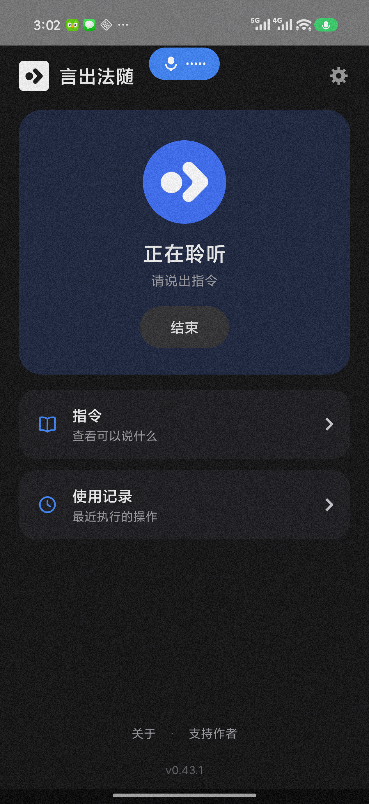
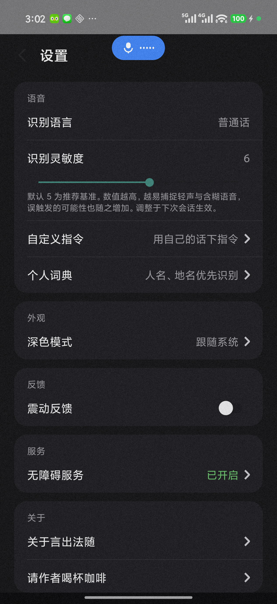

# 言出法随

<p align="center">
  <b>系统级 · 全离线 · 零数据上传 · 中文原生</b><br>
  安卓语音控制应用：说出指令，手机执行。
</p>

**语言 / Language**: 简体中文 | [English](README.md)

---

## 一、项目解决什么问题

SMA（脊髓性肌萎缩症）等肢体障碍用户无法触屏操作手机，而「打不了字」与「点不了屏幕」之间，隔着一整个数字生活。

与此同时，国产安卓阵营几乎没有任何厂商投入系统级的语音控制；唯一跟进过的小米，其语音辅助也长期缺乏更新与维护，难以适配当前复杂的应用生态。

**言出法随**用「无障碍服务 + 离线语音识别」把操作权交还给声音：无需联网、无需专用硬件、无需电脑常伴——一部普通安卓手机，说话即可完成滑动、点击、输入等几乎全部操作。

## 二、主要功能

- **屏幕编号**：说「显示编号」，屏幕上可点击的元素标注数字，说「点击 18」即可精准点击
- **屏幕网格**：全屏划分十二宫格，可逐级细化，说编号即可触达屏幕任意位置
- **滑动与摇移**：「向上滑动」翻页浏览；「向上摇移」小步微调对准位置
- **双指放大 / 缩小**：看图片、看网页的捏合手势
- **语音输入**：说「输入」→ 说出内容 → 停顿后自动填入输入框（微信等聊天场景）
- **文字编辑**：「删除」逐字回退、「光标左移 / 右移」、「把不错替换成很好」语音纠错
- **自定义指令**：用自己的说法绑定任意动作（语音录入，零打字）
- **个人词典**：人名、地名加入词典后优先识别（如「黄信豪」）
- **设备控制**：音量调节（80% 安全上限）、静音、锁屏、通知中心、控制中心
- **全离线识别**：内置 SenseVoice 离线中文识别引擎，无网络也能用
- **安全设计**：会话制占用麦克风、看门狗自动退出、静音自动释放、误触发熔断、无障碍静默自愈

<p align="center">
  
  
</p>

## 三、安装方法

### 普通用户

1. 前往 [Releases](../../releases) 页面，下载最新的 APK 文件
2. 安装（需要允许安装未知来源应用）
3. 首次启动后按引导依次完成：电池优化豁免 → 自启动授权 → 开启无障碍服务
4. 建议在最近任务中锁定本应用，以保持后台长期运行

要求：Android 7.0 及以上。

### 开发者构建

```bash
# 1. 克隆本仓库
git clone https://github.com/qb200310-hash/YanChuFaSui.git

# 2. 下载识别模型（约 240MB，不入仓库）
powershell -ExecutionPolicy Bypass -File scripts/download_models.ps1

# 3. 用 Android Studio 打开，或命令行构建
./gradlew assembleDebug
```

## 四、使用方法

打开应用 → 点「开始控制」→ 胶囊变蓝表示正在聆听 → 说出指令 → 手机执行。说「退出」随时结束会话并归还麦克风。

常用指令速查：

| 类别 | 指令 |
|---|---|
| 浏览 | 向上滑动 / 向下滑动 / 向左滑动 / 向右滑动 |
| 定位 | 显示编号 → 点击 18 ｜ 显示网格 → 点击 5 |
| 操作 | 轻点 ｜ 双击 ｜ 长按 → 3 ｜ 长按抖音 |
| 导航 | 返回 ｜ 前往主屏幕 ｜ 打开 App 切换器 |
| 微调 | 向上摇移 / 向左摇移 ｜ 双指放大 / 双指缩小 |
| 文字 | 输入 → 说出内容 ｜ 删除 ｜ 光标左移 / 右移 ｜ 把 A 替换成 B |
| 个性化 | 自定义指令（设置页）｜ 个人词典（设置页）|
| 设备 | 增加音量 / 降低音量 / 静音 ｜ 锁屏 ｜ 通知中心 / 控制中心 |
| 结束 | 退出 |

设置页可调：识别灵敏度（适配轻声与含糊语音）、自定义指令、个人词典、深色模式、震动反馈。

## 五、输入输出示例

| 你说 | 手机做什么 |
|---|---|
| 「显示编号」 | 屏幕上可点击的元素全部标注数字 |
| 「点击 18」 | 点击编号 18 对应的元素 |
| 「向上滑动」 | 屏幕内容向上滚动一页 |
| 「输入」→「今天天气不错」 | 输入框出现文字「今天天气不错」 |
| 「把不错替换成很好」 | 输入框中的「不错」被替换为「很好」 |
| 「增加音量」 | 媒体音量加一格（80% 封顶，防误触失控） |
| 「退出」 | 结束会话，麦克风归还系统 |

## 隐私承诺

全离线识别，语音数据不出手机；无障碍服务读取的屏幕内容仅在本机用于指令解析；应用不收集、不上传、不存储任何个人数据。

## 支持与联系

- 应用名「言出法随」与品牌归属：**黄信豪 (Hugo)**
- 支持作者：[爱发电 · afdian.com/a/hugoqb](https://afdian.com/a/hugoqb)

## License

[Apache-2.0](LICENSE) © 2026 黄信豪 (Hugo)

## 致谢

- [sherpa-onnx](https://github.com/k2-fsa/sherpa-onnx) 与 [SenseVoice](https://github.com/FunAudioLLM/SenseVoice) —— 离线中文语音识别引擎
- [pinyin4j](https://github.com/belerweb/pinyin4j) —— 拼音转换
